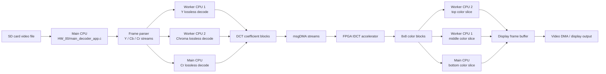

# Architecture

This project splits an MJPEG-style video decoder across three Nios II software applications and custom FPGA hardware. The main CPU owns I/O and orchestration, two worker CPUs process independent decode/color-conversion work, and the IDCT accelerator handles the most arithmetic-heavy block transform through msgDMA.

## Runtime Pipeline

## Responsibilities

| Component | Responsibility |
| --- | --- |
| `Software/HW_00/main_decoder_app.c` | SD input, playback controls, mailbox scheduling, hardware IDCT DMA setup, display buffer registration |
| `Software/HW_01/worker_cpu_1.c` | Y-channel lossless decode and middle frame-slice color conversion |
| `Software/HW_02/worker_cpu_2.c` | Chroma lossless decode and top frame-slice color conversion |
| `Software/HW_00/decoder/mjpeg423_decoder.c` | Main decode pipeline, frame parsing, worker coordination, DMA orchestration |
| `IDCT/` | Custom two-dimensional IDCT hardware implementation |
| `ip/` | Supporting FPGA IP, including pixel conversion and SD controller logic |

## Data Movement

- Mailbox messages carry command IDs and pointers to shared decode/color-conversion work packages.
- `COMMAND_LOSSLESS_DECODE` asks a worker CPU to decode coefficient blocks for one channel.
- `COMMAND_COLOR_CONVERT` asks a worker CPU to convert an assigned row range into the current display buffer.
- msgDMA moves decoded DCT blocks into the IDCT accelerator and writes transformed 8x8 blocks back to memory.

## Engineering Tradeoffs

- The pipeline favors explicit coordination over abstraction so hardware/software interactions remain visible.
- Worker source files intentionally mirror each other: that makes CPU responsibilities easy to compare during review.
- Broad cache flushes are conservative for a shared-memory FPGA system. A production cleanup would replace them with targeted cache maintenance after hardware validation.
- Polling loops are simple and observable in a lab environment. An interrupt-driven model would be a natural next iteration.
